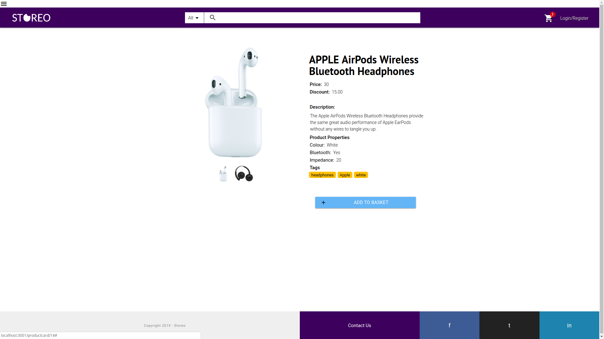
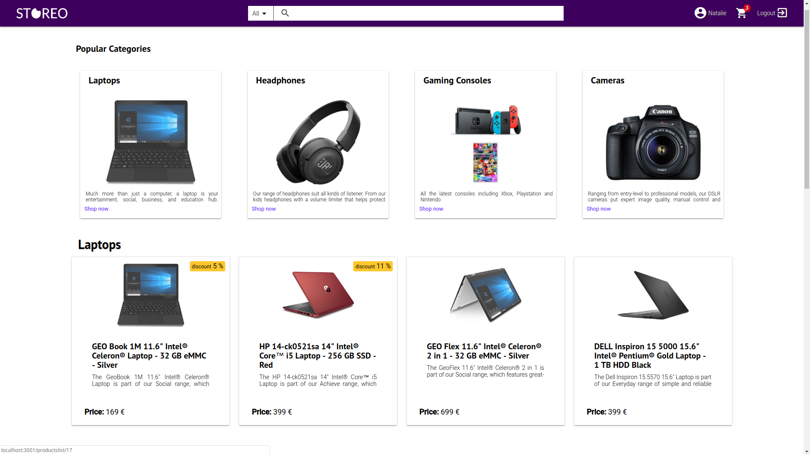

# Storeo

Storeo is an open-source ecommerce framework that allows developers to effortlessly setup an online store.
It's built around clear design principles that make it modular, extendible, and easy to get up and running.

This repo is the back-end of the app, you can find the front-end [here](https://github.com/zain-ali-syed/Storeo_Frontend).





## Getting started

1. Make sure that you have a SQL database installed. (MySQL or PostgreSQL recommended)

2. After installation of SQL database follow respective db guide to start DB. 

For MySQL type: 
```bash
$ sudo mysql.server start
```

Or

```bash
$ mysql -u <user> -p
```

The first command will prompt you to enter your **computer's** password. 
If you use the second command `<user>` is the user name of the DB, by default it is `root` and the default password is `admin`. Be sure to change them.

3. If the previous commands successfully run, now you are logged into your local database.
You should see a command line prompt like the following (for MySQL): `mysql> ` and for PostgreSQL:  `psql>`
4. In the command line prompt type `$ CREATE DATABASE <nameofdatabase>` where `<nameofdatabase>` is the name of the database the Storeo server will be connecting to.

## Launch the Server

1. `$ npm install` for dependencies
2. Follow the `'.env.example'` file to create your own '.env' file. 
3. `$ npm start` to launch the server. The npm start script will automatically use Babel to transpile the code and start the server on default port 3000. Babel is being used we adopted the ES6 import syntax that is not yet supported by Node.
4. `npm run populate` will generate mock data in the database so that you can start testing how the API works right away.
5. An exhaustive Postman collection has been added for your convenience inside the `postman` folder of the repository.

## More resources 

Find a diagram of the database structure [here](https://imgur.com/a/6pRzUzW)

## Tech Stack

* [Node.js](https://nodejs.org/en/)
* [Express](https://expressjs.com/)
* [MySQL](https://www.mysql.com/)
* [Sequelize](http://docs.sequelizejs.com/)
* [JSON Web Tokens](https://www.npmjs.com/package/jsonwebtoken)
* [Faker.js](https://github.com/Marak/faker.js)
* [Stripe](https://stripe.com/docs)

## Contributors

* Christian Francia - [ctfrancia](https://github.com/ctfrancia) - [Linkedin](https://www.linkedin.com/in/ctfrancia/)
* Luca Panzavolta - [LucaPanzavolta](https://github.com/LucaPanzavolta) - [Linkedin](https://www.linkedin.com/in/lucapanzavolta)
* Uros C - [ross-u](https://github.com/ross-u) - [Linkedin](https://www.linkedin.com/in/uros-cirkovic)
* Tomasz Gasienica - [Casprovy](https://github.com/Casprovy) - [Linkedin](https://www.linkedin.com/in/tomasz-g%C4%85sienica-szostak-cfa-279b175/)
* Zain Sayed - [zain-ali-syed](https://github.com/zain-ali-syed) - [Linkedin](https://www.linkedin.com/in/zain-syed-7257927/)

As this is a 100% open source project all contributions and pull requests will be highly welcomed!


